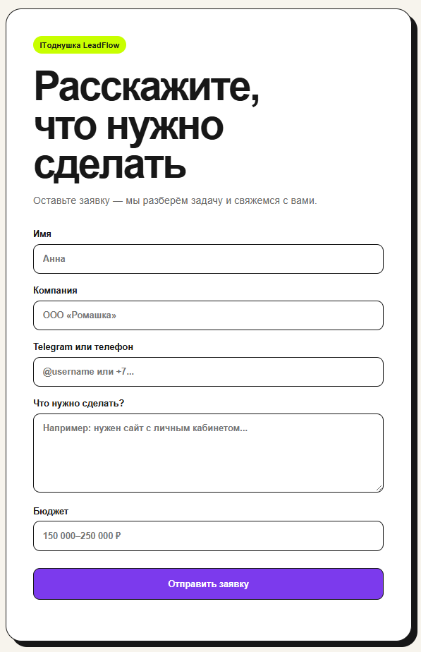
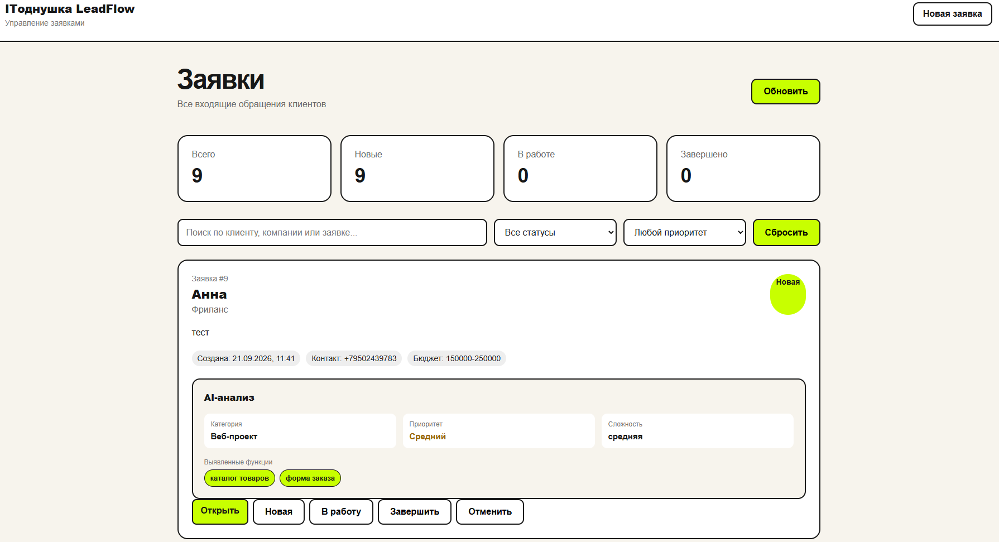
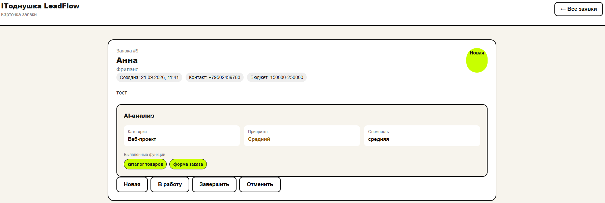

# ITоднушка LeadFlow

AI-система обработки клиентских заявок для IT-студии **ITоднушка**.

Клиент оставляет заявку через веб-форму. Система сохраняет её в SQLite, передаёт текст локальной AI-модели для анализа, отправляет уведомление в Telegram и отображает заявку в административной панели.

## Как это работает

```text
┌─────────────────┐
│  Клиентская     │
│  веб-форма      │
└────────┬────────┘
         │
         ▼
┌─────────────────┐
│     FastAPI     │
│      API        │
└───────┬─────────┘
        │
        ├──────────────► SQLite
        │
        ▼
┌─────────────────┐
│     Ollama      │
│    llama3.2     │
└────────┬────────┘
         │
         ▼
┌─────────────────┐
│   AI-анализ     │
│ категории       │
│ приоритета      │
│ функций         │
│ сложности       │
└────────┬────────┘
         │
         ├──────────────► Telegram
         │
         ▼
┌─────────────────┐
│   Админ-панель  │
│ заявки / поиск  │
│ фильтры / статусы│
└─────────────────┘
```

## Интерфейс

### Клиентская форма

Форма позволяет клиенту описать задачу, указать контактные данные и бюджет.



### Административная панель

Администратор видит все заявки, статистику, AI-приоритет, поиск и фильтры.



### Карточка заявки

В карточке отображается исходная заявка, её статус и структурированный AI-анализ.



## Возможности

### Клиентская часть

* форма отправки заявки;
* имя клиента;
* компания;
* контакт;
* описание задачи;
* бюджет;
* клиентская валидация;
* отправка данных через REST API.

### Backend

* FastAPI REST API;
* SQLite;
* SQLAlchemy;
* валидация данных через Pydantic;
* получение списка заявок;
* получение отдельной заявки;
* изменение статуса заявки;
* сохранение заявки до начала AI-анализа;
* обработка ошибок AI без потери заявки;
* повторный запуск AI-анализа для неудачных заявок.

### Валидация

API проверяет основные ограничения входных данных:

* имя — от 2 до 100 символов;
* компания — до 200 символов;
* контакт — от 3 до 200 символов;
* описание задачи — от 10 до 5000 символов;
* бюджет — до 100 символов.

## AI-анализ

Для анализа используется локальная модель **llama3.2** через Ollama.

AI определяет:

* категорию проекта;
* приоритет;
* конкретные функции из заявки;
* предварительную сложность проекта.

Категории:

```text
web
mobile
automation
integration
bot
other
```

Приоритет:

```text
low
medium
high
```

Сложность:

```text
низкая
средняя
высокая
```

Для каждой заявки также сохраняется статус AI-обработки:

```text
pending
completed
failed
```

Если AI-анализ завершился ошибкой, заявка не теряется. Она остаётся в базе и может быть обработана повторно из карточки заявки.

AI работает локально, поэтому текст заявки не требуется отправлять во внешний AI API.

## Telegram

После создания заявки система автоматически отправляет уведомление в Telegram.

В уведомлении отображаются:

* номер заявки;
* клиент;
* компания;
* контакт;
* бюджет;
* текст заявки;
* AI-категория;
* приоритет;
* сложность;
* выявленные функции;
* статус AI-анализа.

Ошибки Telegram не приводят к потере самой заявки: данные уже сохранены в базе.

## Административная панель

Администратор может:

* просматривать все заявки;
* открывать подробную карточку заявки;
* искать заявки;
* фильтровать по статусу;
* фильтровать по AI-приоритету;
* менять статус;
* видеть дату создания;
* просматривать AI-анализ;
* повторно запускать AI-анализ, если предыдущая попытка завершилась ошибкой.

Статусы заявок:

```text
new
in_progress
done
cancelled
```

В интерфейсе они отображаются как:

```text
Новая
В работе
Завершена
Отменена
```

## API

### Создание заявки

```http
POST /leads
```

Пример:

```json
{
    "name": "Алексей",
    "company": "WebTest",
    "contact": "@alex_test",
    "message": "Нужен интернет-магазин с каталогом товаров, корзиной и оплатой.",
    "budget": "200000"
}
```

### Получение всех заявок

```http
GET /leads
```

### Получение заявки

```http
GET /leads/{lead_id}
```

### Запуск или повторный AI-анализ

```http
POST /leads/{lead_id}/analyze
```

### Изменение статуса

```http
PATCH /leads/{lead_id}/status
```

Пример:

```json
{
    "status": "in_progress"
}
```

## Пример AI-анализа

Заявка:

> Нужен интернет-магазин с каталогом товаров, корзиной и оплатой.

Результат:

```json
{
    "category": "web",
    "priority": "medium",
    "features": [
        "каталог товаров",
        "корзина",
        "оплата"
    ],
    "estimate": "средняя"
}
```

## Стек

### Backend

* Python 3.13
* FastAPI
* SQLAlchemy
* Pydantic
* SQLite
* Uvicorn

### AI

* Ollama
* llama3.2

### Интеграции

* Telegram Bot API
* HTTPX

### Frontend

* HTML
* CSS
* JavaScript

### Инфраструктура

* Git
* GitHub
* `.env`

## Структура проекта

```text
itodnushka-leadflow/
│
├── frontend/
│   ├── index.html
│   ├── app.js
│   ├── style.css
│   ├── admin.html
│   ├── admin.js
│   ├── admin.css
│   ├── lead.html
│   └── lead.js
│
├── screenshots/
│   ├── frontend.png
│   ├── admin.png
│   └── lead.png
│
├── services/
│   ├── ai_service.py
│   ├── lead_service.py
│   └── telegram_service.py
│
├── database.py
├── models.py
├── main.py
│
├── .env.example
├── .gitignore
├── requirements.txt
└── README.md
```

## Запуск

### 1. Клонирование

```bash
git clone https://github.com/mckotello/itodnushka-leadflow.git
cd itodnushka-leadflow
```

### 2. Создание виртуального окружения

Windows:

```powershell
python -m venv .venv
```

Активация:

```powershell
.venv\Scripts\activate
```

### 3. Установка зависимостей

```powershell
pip install -r requirements.txt
```

### 4. Настройка `.env`

Создайте файл `.env` в корне проекта:

```env
TELEGRAM_BOT_TOKEN=
TELEGRAM_CHAT_ID=
TELEGRAM_PROXY=
```

`.env` не должен попадать в Git.

В некоторых сетях для доступа к Telegram может потребоваться SOCKS5-прокси.

### 5. Установка Ollama

Установите Ollama и скачайте модель:

```bash
ollama pull llama3.2
```

Убедитесь, что Ollama запущен.

### 6. Запуск backend

Из корня проекта:

```powershell
uvicorn main:app --reload
```

API будет доступен по адресу:

```text
http://127.0.0.1:8000
```

Swagger:

```text
http://127.0.0.1:8000/docs
```

### 7. Запуск frontend

Откройте второе окно PowerShell:

```powershell
cd frontend
python -m http.server 5500
```

Клиентская форма:

```text
http://127.0.0.1:5500
```

Административная панель:

```text
http://127.0.0.1:5500/admin.html
```

## Безопасность

Секретные данные не хранятся в исходном коде.

Конфигурация Telegram находится в `.env`.

Файл `.env` добавлен в `.gitignore` и не публикуется в репозитории.

Административная панель в текущей версии не имеет авторизации и предназначена для локального демонстрационного использования.

Для production-версии необходимо добавить:

* авторизацию администратора;
* ограничение доступа к административным endpoint'ам;
* более строгую настройку CORS;
* безопасное хранение секретов;
* миграции базы данных.

## Что демонстрирует проект

Проект показывает полный backend-процесс обработки клиентской заявки:

```text
Получение данных
       ↓
Валидация
       ↓
Сохранение в БД
       ↓
AI-анализ
       ↓
Структурированный результат
       ↓
Telegram-уведомление
       ↓
Административная панель
       ↓
Изменение статуса
```

При ошибке AI:

```text
Заявка
   ↓
Сохранение в БД
   ↓
AI-анализ
   ↓
Ошибка
   ↓
ai_status = failed
   ↓
Повторный запуск из админ-панели
```

Проект демонстрирует работу с REST API, ORM, SQLite, локальной LLM, валидацией данных, внешним HTTP API и отдельным frontend.

## Автор

**ITоднушка**

Разработка сайтов, веб-сервисов, автоматизация и интеграции для бизнеса.

> Пока у других IT-студии — здесь уже однушка!
